# Multi-Dataset Testing in Kaggle Notebook

## ✅ Changes Pushed to GitHub

The Kaggle notebook now supports **multi-dataset validation** - you can test all 8 datasets in one run before launching full experiments!

## 🎯 What Was Added

### Cell 4: New TEST_ALL_DATASETS Option
```python
SMOKE_TEST = True  # Quick 2-minute test
TEST_ALL_DATASETS = False  # ← Set to True to test all 8 datasets
```

When `TEST_ALL_DATASETS = True`:
- Tests all 8 datasets: BC2GM, JNLPBA, ChemProt, DDI, GAD, HoC, PubMedQA, BIOSSES
- 100 samples × 3 epochs per dataset
- Takes ~20-30 minutes total
- Automatically handles different task types (NER, RE, Classification, QA, Similarity)

### Cell 10: Multi-Dataset Training Loop
- Automatically loops through all 8 datasets
- Handles different splits (train/validation/test)
- Configures correct metrics for each task type
- Collects results for all datasets
- Shows summary table at the end
- Saves CSV: `results/dataset_validation_YYYYMMDD_HHMMSS.csv`

### Cell 11: Smart Skip
- Skips evaluation when multi-dataset mode was used (already done in loop)

### Cell 12: Enhanced Summary
- Shows multi-dataset results
- Displays pass/fail counts
- Provides next steps based on results

## 🚀 How to Use

### Option 1: Test All Datasets (Recommended Before Full Experiments)
```python
# Cell 4:
SMOKE_TEST = False  # or True for faster test
TEST_ALL_DATASETS = True  # ← Enable multi-dataset testing
```

Then run all cells. Expected output:
```
============================================================
📊 MULTI-DATASET VALIDATION SUMMARY
============================================================

Results:
  dataset    task_type                      f1  precision  recall  time_seconds status
   bc2gm     ner                         0.635      0.680   0.595           120   PASS
   jnlpba    ner                         0.580      0.620   0.545           125   PASS
  chemprot   re                          0.620      0.650   0.590           130   PASS
       ddi   re                          0.650      0.680   0.625           128   PASS
       gad   classification              0.720      0.740   0.700           115   PASS
       hoc   multilabel_classification   0.450      0.480   0.425           120   PASS
  pubmedqa  qa                          0.550      0.580   0.525           118   PASS
   biosses   similarity                  0.000      0.000   0.000           122   PASS

Passed: 8/8 ✅
Failed: 0/8 ❌
Errors: 0/8 💥
============================================================

🎉 ALL DATASETS PASSED!
✅ Ready for full experiments (7 models × 8 tasks)
```

### Option 2: Single Dataset (Original Behavior)
```python
# Cell 4:
SMOKE_TEST = True  # or False
TEST_ALL_DATASETS = False  # ← Keep disabled
```

Works exactly as before!

## 📊 Expected Results (Multi-Dataset Test)

| Dataset | Task Type | Expected F1 | Pass Threshold |
|---------|-----------|-------------|----------------|
| BC2GM | NER | 0.60-0.65 | > 0.30 |
| JNLPBA | NER | 0.55-0.60 | > 0.30 |
| ChemProt | RE | 0.55-0.65 | > 0.30 |
| DDI | RE | 0.60-0.70 | > 0.30 |
| GAD | Classification | 0.70-0.75 | > 0.30 |
| HoC | Multi-label | 0.40-0.50 | > 0.30 |
| PubMedQA | QA | 0.50-0.60 | > 0.30 |
| BIOSSES | Similarity | Pearson > 0.60 | Pearson > 0.50 |

**Note**: These are smoke test scores (100 samples, 3 epochs). Full training scores will be much higher!

## 🔧 What Gets Tested

For each dataset, the notebook:
1. ✅ Loads pickle data correctly
2. ✅ Handles train/validation/test splits
3. ✅ Creates UniversalMedicalDataset
4. ✅ Loads correct model head (TokenClassification vs SequenceClassification)
5. ✅ Uses correct metrics (NER vs Classification vs Regression)
6. ✅ Trains without errors
7. ✅ Evaluates successfully
8. ✅ Achieves reasonable F1 score

## 💾 Output Files

After multi-dataset test, check:
- `results/dataset_validation_YYYYMMDD_HHMMSS.csv` - Full results table
- Console output - Summary with pass/fail status

CSV columns:
- `dataset`, `task_type`, `model_type`
- `train_samples`, `val_samples`, `num_epochs`
- `f1`, `precision`, `recall`, `accuracy`
- `train_loss`, `eval_loss`
- `time_seconds`, `status` (PASS/FAIL/ERROR)

## 🎉 Success Criteria

**Ready for full experiments when:**
- ✅ 7-8 out of 8 datasets pass (F1 > 0.30 or Pearson > 0.50)
- ✅ No ERROR status
- ✅ All task types represented (NER, RE, Classification, QA, Similarity)
- ✅ Total time < 40 minutes

**If some datasets fail:**
1. Check error messages in output
2. Review TROUBLESHOOTING_GUIDE.md
3. Fix issues
4. Re-run multi-dataset test
5. When all pass → proceed with full 7 models × 8 tasks

## 📝 Files Changed

- `KAGGLE_COMPLETE.py` - Notebook generator with multi-dataset capability
- `KAGGLE_COMPLETE.ipynb` - Regenerated notebook

**Commit**: `34e5448` - "Add multi-dataset testing capability to Kaggle notebook"

**GitHub**: Changes pushed to `master` branch

## 🔗 Related Files

- `validate_all_datasets_smoke_test.py` - Standalone script (alternative to notebook)
- `MULTI_MODEL_SMOKE_TEST_GUIDE.md` - Guide for testing all 7 models
- `TROUBLESHOOTING_GUIDE.md` - Comprehensive troubleshooting reference

## 💡 Tips

1. **Run multi-dataset test BEFORE full experiments** - catches issues early!
2. **Use on Kaggle T4 GPU** - faster than CPU, free tier sufficient
3. **Save results CSV** - track validation over time
4. **Test after code changes** - ensure nothing broke
5. **Share CSV with team** - document baseline performance

## 🚦 Workflow

```mermaid
graph LR
    A[Upload to Kaggle] --> B[Set TEST_ALL_DATASETS=True]
    B --> C[Run All Cells]
    C --> D{All Pass?}
    D -->|Yes| E[Run Full Experiments<br/>7 models × 8 tasks]
    D -->|No| F[Fix Issues]
    F --> C
```



## ✅ Next Steps

1. **Upload KAGGLE_COMPLETE.ipynb to Kaggle**
2. **Set TEST_ALL_DATASETS = True in Cell 4**
3. **Run all cells** (~20-30 minutes)
4. **Review results table**
5. **If all pass**: Set TEST_ALL_DATASETS = False, proceed with full experiments
6. **If some fail**: Check TROUBLESHOOTING_GUIDE.md and fix issues

---

**Remember**: Multi-dataset test is a quick validation (100 samples, 3 epochs). Full experiments use all samples and 10 epochs for SOTA results!
